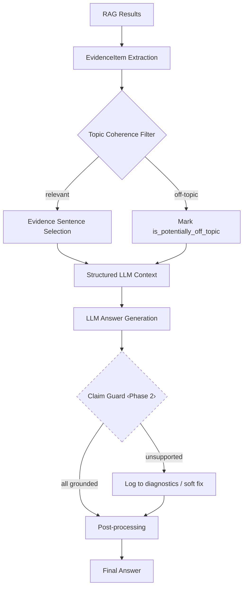

# Structured Evidence & Answer Quality — Revised Plan

## Problem Summary

The system produces answers with several quality issues:
1. **Missing critical info** — important facts from sources (numbers, dates, conditions) not reaching final answer
2. **Hallucinated details** — portals, menus, payment channels, documents fabricated by LLM
3. **Meta artifacts** — "Soru:", "Yanıt:", "Benchmark" leaking into final answer
4. **Turkish quality** — broken sentences, repetition, unnatural phrasing
5. **Irrelevant sources** — high-scoring but off-topic sources misleading the LLM
6. **Cross-department synthesis issues** — global synthesis inventing claims not in any department's sources

## Architecture Overview



> [!NOTE]
> LLM Verifier (Phase 3) is **not shown** — it is off by default and only wired after benchmark evaluation.

---

## Design Principles (from review feedback)

| # | Principle | How we honor it |
|---|-----------|-----------------|
| 1 | LLM verifier **OFF by default** | Phase 3 only; config flag `ENABLE_LLM_ANSWER_VERIFIER=false` |
| 2 | Claim guard **not aggressive** | Softens only high-confidence unsupported numeric/entity claims; rest → diagnostics only |
| 3 | Topic coherence **no new LLM/embedding call** | Uses query-term overlap, score, score_type, metadata, department match — 100% deterministic |
| 4 | Module placement **shared** | `src/quality/evidence.py` + `src/quality/claim_guard.py` — importable from agents & orchestrators without cycles |
| 5 | Preserve existing improvements | `_extract_evidence_content`, registration_utils filters, `clean_final_answer` → kept, generalized where possible |
| 6 | No extra LLM call for structured draft | Same specialist/global synthesis call; prompt context enhanced with structured evidence |
| 7 | Minimal schema change | Evidence data in `local_profile.attributes` — no new fields on `QueryDiagnostics` |
| 8 | A2A/local parity | Evidence + claim guard logic runs on both modes; no DepartmentResponse changes |
| 9 | Behavioral tests only | No benchmark-question-specific hardcodes |
| 10 | Phased execution | Phase 1 → Phase 2 → Phase 3 with tests after each |

---

## Phase 1: EvidenceItem + Structured Context + Diagnostics

### [NEW] src/quality/__init__.py

Empty init for the new package.

### [NEW] [evidence.py](file:///c:/Users/ÖMER%20FARUK%20DERİN/Desktop/bitirme%20projesi/university_support_system/university_support_system/src/quality/evidence.py)

**1. `EvidenceItem` dataclass**

```python
@dataclass
class EvidenceItem:
    source_name: str
    source_id: str            # hash of source+chunk for dedup
    department: str
    score: float
    score_type: str           # "reranker" | "retrieval" | "semantic_similarity"
    content_snippet: str      # original full retrieved content
    selected_sentences: list[str]  # query-relevant sentences
    matched_query_terms: set[str]
    relevance_score: float    # computed topic relevance (0-1), no LLM
    extracted_facts: list[str]  # numbers, dates, %, conditions
    supported_aspects: list[str]  # "timing", "condition", "fee", etc.
    is_low_confidence: bool
    is_potentially_off_topic: bool
```

**2. `extract_evidence_items(query, results, department)` → `list[EvidenceItem]`**

Converts raw RAG result dicts to `EvidenceItem` list. For each result:
- Normalizes query terms (reuses `normalize_text`)
- Computes `matched_query_terms` via intersection with content terms
- Computes `relevance_score` via weighted term overlap (no embedding call):
  - base: `len(matched) / len(query_terms)`
  - bonus for numbers/dates/conditions in content that match query domain
  - bonus if source metadata department matches expected department
  - penalty if score_type=="reranker" but score < 0.40
- Extracts `extracted_facts` via regex (numbers, dates, percentages, AKTS, GNO, süre, koşul phrases)
- Detects `is_potentially_off_topic`: high retriever score (≥0.50) but relevance_score < 0.15 AND no matched_query_terms overlap
- Sets `is_low_confidence` using existing thresholds from `base.py`
- Detects `supported_aspects` via the same approach as `REGISTRATION_QUERY_ASPECTS` but generalized

**3. `select_evidence_sentences(query, content, ...)` → `str`**

Enhanced version of the existing `BaseSpecialistAgent._extract_evidence_content`. Improvements:

- **Context window**: when a sentence is selected, also include its immediate neighbor if the neighbor contains a pronoun/reference ("bu", "bunun", "söz konusu") or is a sub-item of a numbered list
- **Heading/bullet preservation**: if a sentence starts with a number/bullet, include the preceding heading line
- **Numeric/date bonus**: stronger weight (+0.25 vs current +0.18) for sentences containing critical data patterns
- **Position bonus**: first sentence of content gets +0.05 (often contains the core definition)
- **Minimum coverage**: if no sentence scores above threshold, return the first 2 sentences as fallback instead of full content (prevents sending irrelevant bulk)

This function **replaces** the logic currently in `_extract_evidence_content` on `base.py` — the old method becomes a thin wrapper calling this.

**4. `compute_topic_coherence(query_terms, source_content, source_metadata, department)` → `float`**

100% deterministic, no LLM/embedding:
- Query term set (normalized, stopwords removed — reuse existing `_EVIDENCE_STOPWORDS`)
- Source term set (first 500 chars, normalized)
- Base score: `len(intersection) / max(len(query_terms), 1)`
- Department match bonus: +0.10 if source metadata department matches expected
- Score type bonus: if `score_type == "reranker"` and `score >= 0.60`, trust the reranker and add +0.15
- Fact overlap bonus: if extracted facts from source match query domain markers, +0.10
- Returns float in [0, 1]

**5. `extract_factual_claims(text)` → `list[str]`**

Regex-based extraction of verifiable claims from text:
- Percentage patterns: `%30`, `yüzde 30`, `0.30`
- Date patterns: `15.01.2025`, `2024-2025`, `güz dönemi`
- Numeric patterns: `2.50 GNO`, `240 AKTS`, `4 yıl`, `30 gün`
- Condition patterns: phrases ending with "zorunludur", "yapılamaz", "gerekir", "yapılabilir", "ödenir", "ödenmez", "muaf"
- Document/system names: recognized by capitalization + known suffixes (UBYS, OBS, vb.)
- Portal/menu names: detected by URL patterns or known system references

---

### [MODIFY] [base.py](file:///c:/Users/ÖMER%20FARUK%20DERİN/Desktop/bitirme%20projesi/university_support_system/university_support_system/src/agents/base.py)

**Changes to `_extract_evidence_content` (line 787):**
- Becomes a thin wrapper: calls `select_evidence_sentences` from `src.quality.evidence`
- Existing logic preserved as fallback if new module raises unexpected error
- No behavioral change for callers

**Changes to `_llm_synthesize` (lines 688-743):**
- After filtering results (line 697 check), build `EvidenceItem` list via `extract_evidence_items`
- Filter out `is_potentially_off_topic==True` from LLM context (but keep them in diagnostics)
- For each evidence item, use `selected_sentences` instead of raw `content` for context chunk
- Annotate each context chunk with confidence indicator:
  ```
  [Kaynak 1: dosya_adi.pdf | Güven: yüksek | Bilgiler: tarih, koşul]
  relevant_sentences_here
  ```
- Include `extracted_facts` as bullet list after sentences so LLM sees them explicitly
- Log evidence summary to profiler: `evidence_item_count`, `off_topic_count`, `facts_extracted`

**Changes to prompt in `_llm_synthesize` (lines 715-743):**
- Add to strategy section: "Kaynakta açıkça geçen sayı, tarih, yüzde, süre, koşul eşiği bilgilerini cevapta MUTLAKA kullan."
- Add: "Düşük güvenli olarak işaretlenen kaynakları yalnızca destekleyici bilgi olarak kullan, ana bilgi kaynağı yapma."
- Existing rules preserved verbatim

> [!NOTE]
> The existing `_compute_keyword_overlap` (line 871), `_EVIDENCE_STOPWORDS`, `_EVIDENCE_SENTENCE_RE`, etc. are preserved for backward compat. The new evidence module can import and reuse them.

---

### [MODIFY] [synthesis_utils.py](file:///c:/Users/ÖMER%20FARUK%20DERİN/Desktop/bitirme%20projesi/university_support_system/university_support_system/src/orchestrators/synthesis_utils.py)

**Changes to `_build_response_context_payload` (line 82):**
- Build `EvidenceItem` list from each response's sources using `extract_evidence_items`
- Include `extracted_facts` per department in the JSON payload
- Mark evidence confidence level: `"evidence_confidence": "high" | "low"`
- Keep existing `answer_summary` and `evidence` snippet fields — extend, don't replace

**Changes to `build_global_synthesis_prompt` (line 116):**
- Add extracted facts per department in the machine context JSON
- Add to prompt rules:
  - "Bir departmanın kaynağından diğer departmanın sorumluluk alanına ait iddia çıkarma."
  - "Finans kaynağında geçmeyen akademik koşul yazma. Akademik kaynakta geçmeyen ödeme kanalı yazma."
  - "Kanıt olarak verilen extracted_facts listesindeki bilgileri cevapta koru."

**Changes to `_extract_global_evidence_snippet` (line 34):**
- Use `select_evidence_sentences` from `src.quality.evidence` for consistency with specialist pipeline
- Keep existing fallback behavior

---

### [MODIFY] [prompt_templates.py](file:///c:/Users/ÖMER%20FARUK%20DERİN/Desktop/bitirme%20projesi/university_support_system/university_support_system/src/llm/prompt_templates.py)

- `GENERAL_QA_SYSTEM_PROMPT` (line 98): Add one line about structured evidence format
- `MULTI_DEPARTMENT_SYNTHESIS_SYSTEM_PROMPT` (line 299): Add cross-department boundary rules
- No other prompt changes in Phase 1

---

### [MODIFY] [response_utils.py](file:///c:/Users/ÖMER%20FARUK%20DERİN/Desktop/bitirme%20projesi/university_support_system/university_support_system/src/orchestrators/response_utils.py)

Enhance `clean_final_answer()` (line 254) — conservative additions only:
- **Sentence deduplication**: normalize each sentence → hash → remove exact duplicates
- **Empty heading removal**: `re.sub(r"^#+\s*$", "", ...)`  on each line
- **Repeated heading detection**: if same heading text appears twice consecutively, remove duplicate
- **Excessive whitespace**: already handled, keep as-is
- All existing cleanup rules preserved verbatim — no removals

---

### [MODIFY] [user_response_builders.py](file:///c:/Users/ÖMER%20FARUK%20DERİN/Desktop/bitirme%20projesi/university_support_system/university_support_system/src/orchestrators/user_response_builders.py)

In `_build_query_diagnostics` (line 89):
- If profiler has evidence attributes, they'll naturally appear in `local_profile.attributes`
- No changes to function signature or `QueryDiagnostics` schema
- Profiler attributes set by base.py during evidence extraction:
  ```python
  profiler.set_attribute("evidence_summary", {
      "evidence_item_count": 3,
      "sources_in_context": 2,
      "sources_off_topic": 1,
      "facts_extracted": 5,
      "global_synthesis_used": False,
  })
  ```

---

### [NEW] [test_evidence.py](file:///c:/Users/ÖMER%20FARUK%20DERİN/Desktop/bitirme%20projesi/university_support_system/university_support_system/tests/unit/test_evidence.py)

Behavioral unit tests:

1. `test_off_topic_source_marked_when_high_score_but_no_query_overlap` — irrelevant high-scoring source gets `is_potentially_off_topic=True`
2. `test_relevant_source_not_marked_off_topic` — relevant source stays `is_potentially_off_topic=False`
3. `test_critical_numbers_preserved_in_selected_sentences` — source with "GNO 2.50", "%30", "240 AKTS" → preserved in selected_sentences
4. `test_context_window_keeps_neighbor_sentence` — selected sentence with reference → neighbor included
5. `test_heading_structure_preserved` — numbered list item → heading preserved
6. `test_topic_coherence_low_for_unrelated_domains` — query about "bağıl değerlendirme" vs source about "bilgi güvenliği" → low coherence
7. `test_topic_coherence_high_for_matching_domain` — query about "kayıt dondurma" vs source about "kayıt dondurma yönergesi" → high coherence
8. `test_extract_factual_claims_finds_dates_numbers_percentages` — regex catches common Turkish academic fact patterns
9. `test_extract_factual_claims_finds_condition_phrases` — "zorunludur", "yapılamaz" detected
10. `test_student_community_source_not_in_evidence_for_withdrawal_query` — community source filtered out (building on existing registration_utils logic, but at evidence level)
11. `test_student_community_source_kept_for_community_query` — community source preserved when query is about communities
12. `test_evidence_items_sorted_by_relevance` — output ordered by relevance_score descending
13. `test_sentence_deduplication_in_clean_final_answer` — repeated sentences removed
14. `test_meta_artifact_still_cleaned` — "Soru:", "Yanıt:", "Benchmark" still removed (regression guard)

### [MODIFY] [test_response_utils.py](file:///c:/Users/ÖMER%20FARUK%20DERİN/Desktop/bitirme%20projesi/university_support_system/university_support_system/tests/unit/test_response_utils.py)

- Add: `test_clean_final_answer_deduplicates_repeated_sentences`
- Add: `test_clean_final_answer_removes_empty_markdown_headings`

---

### Phase 1 Verification

```bash
python -m pytest tests/unit/test_evidence.py -v
python -m pytest tests/unit/test_response_utils.py -v
python -m pytest tests/unit/test_registration_utils.py -v
python -m pytest tests/unit/ -v --tb=short -x
```

**Expected latency**: +60-150ms deterministic per query. LLM context smaller → specialist LLM slightly faster.

---

## Phase 2: Deterministic Claim Guard

### [NEW] [claim_guard.py](file:///c:/Users/ÖMER%20FARUK%20DERİN/Desktop/bitirme%20projesi/university_support_system/university_support_system/src/quality/claim_guard.py)

**Conservative design — log first, fix minimally:**

**1. `GuardResult` dataclass**
```python
@dataclass
class GuardResult:
    cleaned_answer: str          # possibly modified answer
    unsupported_claims: list[dict]  # [{claim, type, source_checked}]
    modifications_made: int      # count of actual text changes
    diagnostics: dict            # full audit trail
```

**2. `check_numeric_grounding(answer, evidence_items)` → `list[dict]`**
- Extract numbers/dates/percentages from answer via regex
- For each: search all `evidence_items[].extracted_facts`
- If found → "supported"
- If NOT found in ANY evidence → `{"claim": "2.50 GNO", "type": "numeric", "grounded": False}`
- Return list of ungrounded numeric claims

**3. `check_entity_grounding(answer, evidence_items)` → `list[dict]`**
- Detect portal/menu names, payment channels, document names in answer
- Pattern: capitalized multi-word phrases, URL-like references, known system names
- Check if each entity appears in any `evidence_items[].content_snippet` or `selected_sentences`
- Ungrounded entities logged: `{"claim": "e-Devlet portalı", "type": "entity", "grounded": False}`

**4. `check_definitive_claims(answer, evidence_items)` → `list[dict]`**
- Only targets HIGH-CONFIDENCE unsupported definitive statements
- Detect: sentences ending with "zorunludur", "yapılamaz", "kesinlikle gerekir", "asla yapılmaz"
- Check if ANY evidence item supports this definitive claim direction
- If unsupported AND high-confidence mismatch → flag for softening
- If uncertain → log to diagnostics only, DO NOT modify answer

**5. `guard_answer(answer, evidence_items, *, aggressive=False)` → `GuardResult`**
Main entry point:
- Runs `check_numeric_grounding`, `check_entity_grounding`, `check_definitive_claims`
- With `aggressive=False` (default):
  - Only modifies answer for **clear** ungrounded entities (portal/menu names not in any source)
  - Appends softening note: "Bu bilgiyi ilgili birimden teyit etmeniz önerilir."
  - Does NOT delete sentences
  - Does NOT rewrite claims
  - Logs everything to `diagnostics`
- With `aggressive=True` (future, for when verifier confirms):
  - Could do more rewriting (Phase 3)
- Returns `GuardResult` with all audit data

---

### [MODIFY] [base.py](file:///c:/Users/ÖMER%20FARUK%20DERİN/Desktop/bitirme%20projesi/university_support_system/university_support_system/src/agents/base.py)

- After `_llm_synthesize` returns answer, call `guard_answer(answer, evidence_items, aggressive=False)`
- Apply `cleaned_answer` as the returned answer
- Log guard diagnostics to profiler:
  ```python
  profiler.set_attribute("claim_guard", {
      "unsupported_claims": guard_result.unsupported_claims,
      "modifications_made": guard_result.modifications_made,
  })
  ```

### [MODIFY] [main.py](file:///c:/Users/ÖMER%20FARUK%20DERİN/Desktop/bitirme%20projesi/university_support_system/university_support_system/src/orchestrators/main.py)

- After global synthesis answer, run `guard_answer` on the synthesized text
- Build evidence items from all department responses' sources
- Log guard result to profiler
- Guard runs in both local and A2A mode (same code path via `_compose_final_answer`)

---

### [NEW] [test_claim_guard.py](file:///c:/Users/ÖMER%20FARUK%20DERİN/Desktop/bitirme%20projesi/university_support_system/university_support_system/tests/unit/test_claim_guard.py)

1. `test_ungrounded_number_detected` — answer says "GNO 3.00" but evidence has "GNO 2.50" → flagged
2. `test_grounded_number_not_flagged` — answer says "GNO 2.50" and evidence has it → not flagged
3. `test_ungrounded_portal_detected` — answer mentions "e-Kampüs portalı" not in any source → flagged
4. `test_grounded_entity_not_flagged` — answer mentions "UBYS" which is in sources → not flagged
5. `test_unsupported_definitive_claim_softened` — "kesinlikle yapılamaz" without evidence → softened
6. `test_supported_definitive_claim_preserved` — "zorunludur" with matching evidence → preserved
7. `test_uncertain_claim_only_logged_not_modified` — borderline case → only added to diagnostics, answer unchanged
8. `test_guard_does_not_delete_sentences` — even with ungrounded claims, no sentences removed
9. `test_guard_returns_clean_diagnostics` — GuardResult has proper structure
10. `test_global_synthesis_guard_catches_cross_department_fabrication` — synthesis invents payment channel from academic source → flagged

### Phase 2 Verification

```bash
python -m pytest tests/unit/test_claim_guard.py -v
python -m pytest tests/unit/test_evidence.py tests/unit/test_claim_guard.py -v
python -m pytest tests/unit/ -v --tb=short -x
```

**Expected latency**: +20-50ms on top of Phase 1. Total deterministic overhead: ~80-200ms.

---

## Phase 3: Optional LLM Verifier (OFF by default)

### [NEW] [answer_verifier.py](file:///c:/Users/ÖMER%20FARUK%20DERİN/Desktop/bitirme%20projesi/university_support_system/university_support_system/src/quality/answer_verifier.py)

- `verify_answer(answer, evidence_items, llm_service, ...)` → `VerifierResult`
- Short prompt: compare answer claims against evidence, return JSON
- Timeout: 5s (configurable)
- Fallback: if LLM fails, return deterministic guard result only
- Only called when `settings.quality.enable_llm_answer_verifier == True` (default: `False`)

### Config

In `.env` / settings:
```
ENABLE_LLM_ANSWER_VERIFIER=false
LLM_VERIFIER_TIMEOUT_SECONDS=5
```

### Risk signals (for future activation):
- Global synthesis used
- Multiple departments
- Top source score < 0.55
- >3 definitive claims in answer
- Answer-source overlap < 20%

### Phase 3 Verification

```bash
python -m pytest tests/unit/test_answer_verifier.py -v
python -m pytest tests/unit/ -v --tb=short -x
```

**Expected latency when enabled**: +2-5s on ~15-25% of queries. Default: 0ms (disabled).

---

## File Change Summary

| Phase | File | Action | Description |
|-------|------|--------|-------------|
| 1 | `src/quality/__init__.py` | NEW | Package init |
| 1 | `src/quality/evidence.py` | NEW | EvidenceItem, extraction, sentence selection, topic coherence, fact extraction |
| 1 | `src/agents/base.py` | MODIFY | Wire evidence pipeline into `_llm_synthesize`, thin-wrap `_extract_evidence_content` |
| 1 | `src/orchestrators/synthesis_utils.py` | MODIFY | Evidence-grounded global synthesis context |
| 1 | `src/orchestrators/response_utils.py` | MODIFY | Sentence dedup + empty heading removal in `clean_final_answer` |
| 1 | `src/llm/prompt_templates.py` | MODIFY | Minor additions to system prompts for evidence format |
| 1 | `tests/unit/test_evidence.py` | NEW | 14 behavioral tests |
| 1 | `tests/unit/test_response_utils.py` | MODIFY | 2 new tests |
| 2 | `src/quality/claim_guard.py` | NEW | Deterministic claim verification |
| 2 | `src/agents/base.py` | MODIFY | Wire claim guard after LLM synthesis |
| 2 | `src/orchestrators/main.py` | MODIFY | Wire claim guard after global synthesis |
| 2 | `tests/unit/test_claim_guard.py` | NEW | 10 behavioral tests |
| 3 | `src/quality/answer_verifier.py` | NEW | Optional LLM verifier (disabled) |
| 3 | `src/core/config.py` | MODIFY | Add verifier config flags |
| 3 | `tests/unit/test_answer_verifier.py` | NEW | Verifier tests |

---

## Performance Budget

| Component | Latency | When |
|-----------|---------|------|
| Evidence extraction | 20-60ms | Every query |
| Topic coherence | 5-15ms | Every query |
| Sentence selection | 10-30ms | Every query |
| Fact extraction | 5-15ms | Every query |
| Claim guard (Phase 2) | 20-50ms | Every query |
| **Total deterministic** | **60-170ms** | **Every query** |
| LLM verifier (Phase 3) | 2-5s | **Disabled by default** |

Target: **< 300ms total deterministic overhead**. LLM context will be smaller (selected sentences vs full content), partially offsetting the overhead.

---

## Preserved Existing Logic

These will NOT be removed — they'll be generalized or wrapped:

- `base.py::_extract_evidence_content` → thin wrapper around `select_evidence_sentences`
- `base.py::_compute_keyword_overlap` → still used for low-score filtering at line 697
- `base.py::_EVIDENCE_STOPWORDS`, `_EVIDENCE_SENTENCE_RE` → reused by evidence module
- `registration_utils.py` — all topic/aspect/community filters preserved as-is
- `response_utils.py::clean_final_answer` — all existing regex rules preserved, new rules added
- `response_utils.py::_strip_foreign_words` — preserved as-is
- `synthesis_utils.py::_extract_global_evidence_snippet` → delegates to new selection function

---

## A2A/Local Parity

- Evidence extraction runs inside `BaseSpecialistAgent._llm_synthesize` → same code in both modes
- Claim guard runs inside `BaseSpecialistAgent._generate_answer` → same code in both modes
- Global synthesis guard runs inside `MainOrchestrator._compose_final_answer` → same code in both modes
- `DepartmentResponse` schema: **no changes**
- A2A payloads: **no changes**
- Diagnostics appear in `QueryDiagnostics.local_profile.attributes` — already supported, no schema change
- Remote agent diagnostics via `remote_profiles` metadata: **unchanged**
